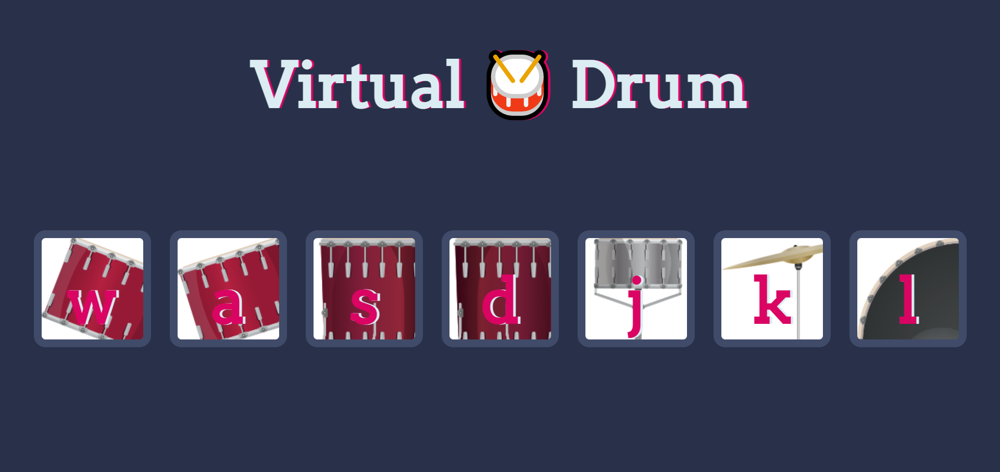

# Virtual Drum: <a href="https://virtual-drum.vercel.app/" target="_blank">Visit Here</a>

Play the virtual drums with your PC keyboard by pressing the keys that correspond to the drums, cymbals, and pedals.

## Built With

- Javascript
- HTML5
- CSS3

## Lessons Learned

In this project, I learned how to add event listeners to button and keystrokes, callback and respond to events.

## Author

Twitter - [@codewithpau](https://twitter.com/codewithpau)
